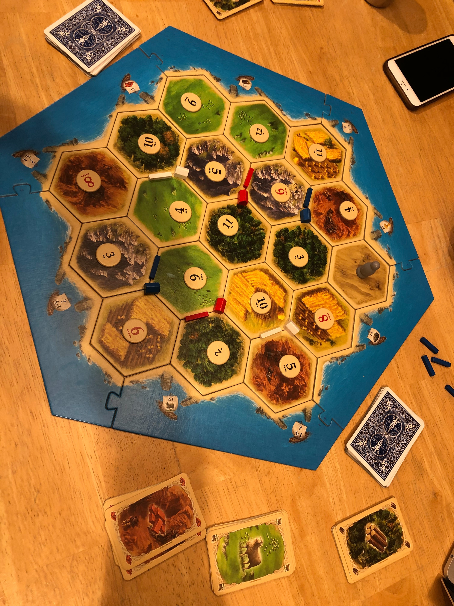
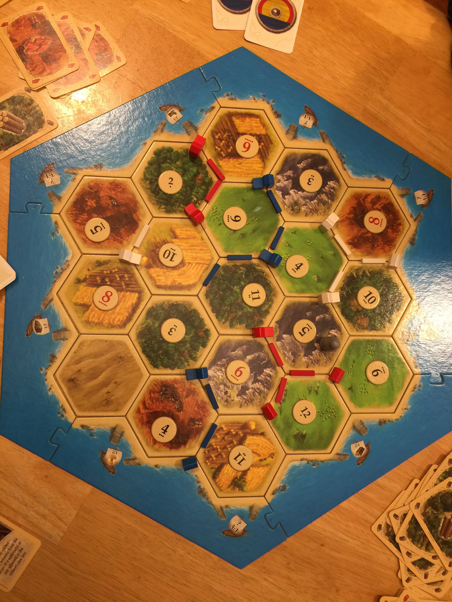
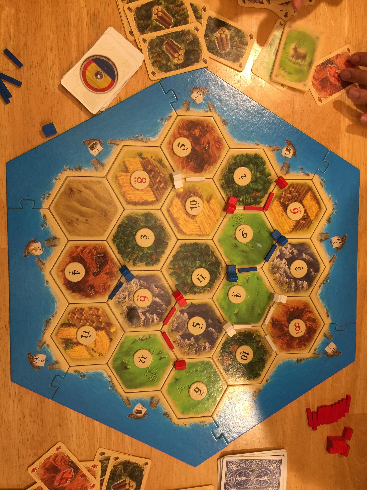

Today, we are playing three games on the same board. Each person will draft as first pick once. We will use a distributed set of cards instead of dice. We have the robinhood rule in place where the lowest VP person gets to use the robber and ties are broken by order.

Blue: Zaibo   
White: Rishi  
Red: Jaidev  

## Game 1

Draft order went Jaidev, Rishi, Zaibo

The H10/H8/B5
Not a 
Draft notes:
- Don't feel too great about the draft. Rishi (white) seems to have gotten the best start.

Game notes:
- Jaidev hits two 7s in his first two rolls. Gets a wood and stone from me and brick future from Rishi. This seems really bad for me.
- Bought a city on turn 9. Put it on the W3/B4/R6 hex (need to hit doubles on 3/4 to get road materials and more rock is better)
- Build a second city on 15
- On 16, a 4 was rolled, and blocked. New game plan is to build dev cards and hold off on a settlement until roll favors me
- ~16 a 7 is rolled and rober goes on R6
- ~30 WBS for RRR deal between Rishi and Zaibo. Allowed Rishi to build a city and Zaibo to build a settlement (on 9S/4S/11W)
- ~33 Built a third city 
- Everyone ends first cycle on 6 points. Not a lot of conflict in the game. My win condition is four cities and largest army. I notice that no one is going for longest road, so that's a potentially possible win condition
- 45 Hit a 7 and had to drop a dev card
- I was one resource away from the win. Jaidev was one resource away from the win. Rishi wins on his turn.

Board on turn 36:

Board on turn 45

## Game 2

### Draft

- Jaidev: almost the same as me except H11 instead of W3. I think this is really dumb. Start out with one less wood and no access to wood for the game.
- Rishi: No hay but has 6 and 8. 
- Similar evaluation to the previous game. I thought Rishi's spots were the best and I picked the same thing.

### Game
- 5 Hit 8 8 10 early on so I got 5 hay. Made a brick for wood future trade to build a super early settlement on 10H/11W/3W. Seems like I'm off to a good start. 
- 6 Rishi gives up cards on a 7
- 11 Getting a lot of resources. I think can get by for most of the game by ignoring everyone else and being self sufficient.
- 17 Jaidev builds a city on 6H/9S/3R. This is one less dot than the other one. This decision balloons from the initial one to shift one space for the hay instead of the wood. Don't think this is a good choice, you want more rock than hay.
- 33 7 is rolled and both Rishi and Jaidev have to give up
- 36 Rishi has to give up again
- At the halfway point, I am clearly in the lead. I have longest road without contention. I will be blocked throughout the entire game.
- 39 I paid a rock and a sheep not to put it on me. The first three rolls of the new cycle were 7s. I think this makes sense. The chance of a 7 is very low now.
- 48 Rishi gives up cards on a 7
- I won but they were both one turn off. After the first cycle, I felt kinda complacent because I was so far ahead. Game was not super interesting because I embargoed for most of it.

## Game 3
We ended up only playing two games. Catan started to get really boring although it's not clear if this is because of the same board or the game itself.