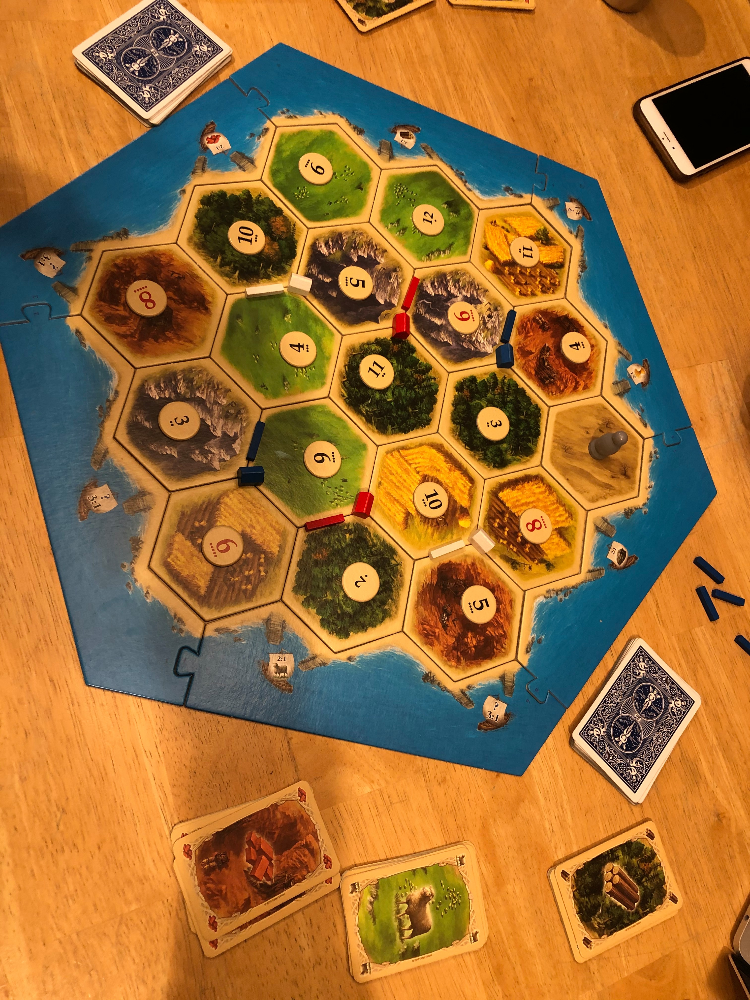
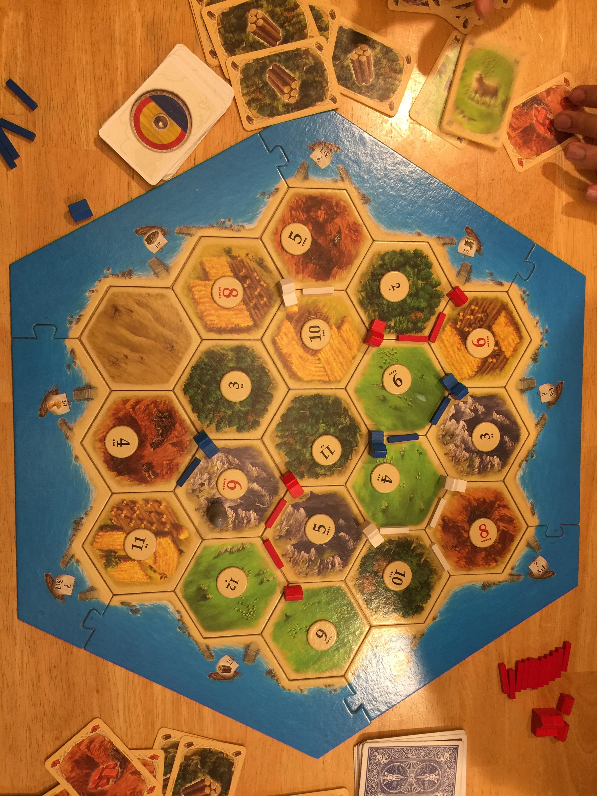

Today, we are playing three games on the same board. Each person will draft as first pick once.

Blue: Zaibo   
White: Rishi  
Red: Jaidev  

## Game 1

Draft order went Jaidev, Rishi, Zaibo

The H10/H8/B5
Not a 
Draft notes:
- Don't feel too great about the draft. Rishi (white) seems to have gotten the best start.

Game notes:
- Jaidev hits two 7s in his first two rolls. Gets a wood and stone from me and brick future from Rishi. This seems really bad for me.
- Bought a city on turn 9. Put it on the W3/B4/R6 hex (need to hit doubles on 3/4 to get road materials and more rock is better)
- Build a second city on 15
- On 16, a 4 was rolled, and blocked. New game plan is to build dev cards and hold off on a settlement until roll favors me
- ~16 a 7 is rolled and rober goes on R6
- ~30 WBS for RRR deal between Rishi and Zaibo. Allowed Rishi to build a city and Zaibo to build a settlement (on 9S/4S/11W)
- ~33 Built a third city 
- Everyone ends first cycle on 6 points. Not a lot of conflict in the game. My win condition is four cities and largest army. I notice that no one is going for longest road, so that's a potentially possible win condition
- 45 Hit a 7 and had to drop a dev card
- I was one resource away from the win. Jaidev was one resource away from the win. Rishi wins on his turn.

Board on turn 36:
![](80296931_915473878887633_5902448717373374464_n.jpg

Board on turn 45
