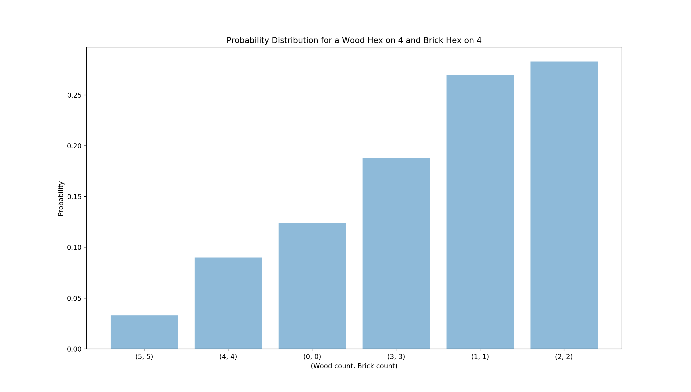
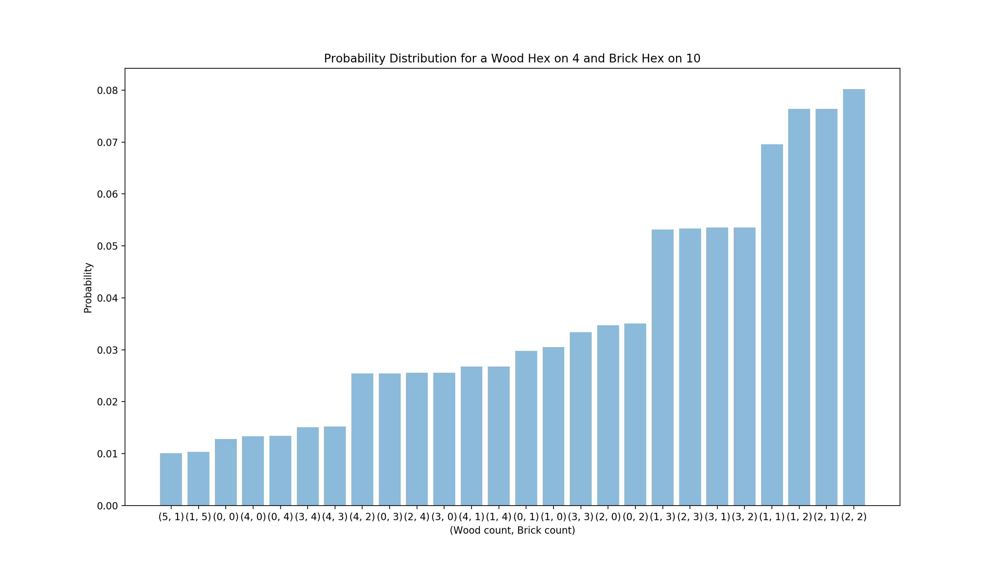

# Settlers of Catan notes

I played a ton catan in the weeks before Fall 2019. Here's an aggregate of everything I learned.

## Pick order
One house rule I play with is the person who rolls the highest in the beginning gets to decide pick order. This leads to a bit more skill expression in draft.

1. If there are two spots that are about equal, pick second
1. First pick pick strat: take the 6-9-5 hex and most of the time, there will be a 8-5-port, 8-5-4 or 8-10-port hex open for second pick. The port doesn't have to be for a high quantity resource. Then build towards an 11 or 3. This gives you insane number coverage
    1. The strength of ports in this case is as insurance. It's not uncommon to have 9 wheat dots and 4 sheep dots but have extra sheep that's useless. A sheep port can be valuable in this situation. Thus, a port for a resource that you don't have a ton of can still be good.
1. Early picks should place their roads away from the center. Avoid building towards a high value hex because it will probably be taken.
1. Last pick has a high skill floor and lowest skill ceiling. Early pick is the opposite. Stronger players are much better at taking advantage of early draft picks because it requires planning around opponents.
1. Last pick (esp in 4 person games) is sometimes forced to go for two toned hex + port. I don't think this is super strong, but often necessary because it's difficult to have all 5 resources.
1. Blocking should never influence first pick settlement. I picked first on a two stone hex thinking I would block all the stone in the game. It didn't work because other people still built next to me. This was a blunder because there was a equal dot, more diverse tile that I could have taken.
1. There seems to be light consensus online that first pick is strongest. I've been preferring second or third pick.

## Drafting

1. Maximize dots
1. Try to cover all 5 resources.
1. Four resource (4R) start:
    1. Generally, there are two types of 4R games
        1. In games with no starting brick or wood, you only need about 5 total of the missing resource for the entire game. Plan around efficient (low road #) settlements and win with 4 cities + largest army. (Note: Wood and brick are similar because they are used in equal quanitity. The only difference is there are four wood tiles and three brick tiles)
        1. In games with no sheep/stone/hay, the 3rd settlement must complete your resources (esp if no port)
1. Generally, it's good to have different numbers to reduce variance. The exception to this rule is that it's good to have same numbers if the resources are synergistic. (Ex: Standard example is same number wood and brick is good because they are always used together. Same number rock and hay is similar but it's not that useful early on because cities require a lot of hits. Less common example is having a hay port + 3 hay + 1 sheep on the same number equating to a dev card). These graphs show the distribution of outcomes in 24 rolls when wood and brick are same/different numbers  
1. If you're playing to win, it could be better to repeat the same numbers for higher variance play. In this case, it's harder to be middling, but more often, you can highroll or lowroll. 

## Longest Road

Longest road should never be a part of the plan at drafting stage because it's situational. Early game roads should be built with the intention of building settlements in good hexes. Longest road is an afterthought when key settlements are built and there's an excess of road material. I've noticed a couple patterns for longest road:

1. Early on, it's a trap. The two points put a target on your back. It's deceiving because a person with longest road has a much lower VP/resource ratio and is not actually in the lead. I usually only get with road builder or to win
1. One person clearly from the start has the most wood/brick and no one contests for longest road. In some cases, this person puts off longest road and ends up losing because someone grabs it 
1. Two people fight for longest road early on and both get behind from wasting using up resources. 
1. No one tries for longest road, the person who has a lead early is able to build it and wins because it costs so little to attain.

## Development Cards

1. Apparently an early dev card can be good and the threat of knighting is strong. I'm not entirely convinced because the Knight can be undone by a 7, monopoly should be saved, VP is disasterous, road builder is decent and year of plenty is 3 resources for 2 of any. I think that in a lot of cases (esp if you have city resources), it's better to hold and build a city. The general rule here is to increase resource production early on and dev cards do not contribute to that.
1. A good mental model for dev cards is to think of how many points each card nets.
    1. Each knight is worth 2/3 VP, -2 net resource, blocks a square
    1. Monopoly should convert into 2 VP. Should be saved until you can win/have winning chances.
        1. The scummiest move in Catan: trade away all of your one resource and monopoly it back.
    1. Year of plenty should convert to 1 VP (this means it should be used to complete a city or settlement). The real power of this card is that it essentially increases your hand size by two.
    1. Road builder should convert to 1-2 VP. Getting longest road is 2 VP case. Otherwise, 2 road + settlement is common use. Only use when you fully utilize both roads, otherwise, hold on to it.

## Path to 10 VP

It's very easy to get to 8 or 9 VP by the time someone reaches 10 VP and ends the game. It's valuable to constantly think about how to reach 10 VP. There's a certain point in the game where people generally stop trading much and it's just about rolling the dice and seeing who has a stronger engine (or luck). At this point, players will have at least three different settlements and two of these will likely be cities. Usually, 6-7 VP come from cities/settlements and the remaining 3-4 VP come from dev cards, largest army and longest road.

1. 3 Cities + Largest army: This is my favorite build because I don't like brick or wood. I get a city before building a 3rd settlement. I get a fast second city. Then I buy dev cards to win the game 
    1. It's easy to get largest army because they use the same resource cities. Knights keep robbers off your squares.
    2. Roadbuilder is a potential win condition by snatching longest road
    3. VP means you only need 1 extra point to win (4th settlement, dig for another VP)
2. 2 Cities + 1 Settlement + VP + Longest Road + Largest army: This is one of the earliest possible victories and it only happens if road is uncontested and you get it to win the game.

## General

1. Catan is like a greedy solution to [the knapsack problem](https://en.wikipedia.org/wiki/Knapsack_problem). Consider if there is no handsize limit - the optimal strategy is to hold onto all your cards until you can build using the constituent resources and avoid trading 4 for 1s. I suspect that people are too afraid of holding 7+ cards. For example, you have 3 dots on sheep, but due to rolls and starting resource, you end up with 4 sheep. You convert 4 sheep for a brick and end up needing sheep later. I haven't done the math, but I think at least in some cases, it's better to hold and wait for more resources to build more efficiently.
1. The meta game in Catan is to convince the other players that you aren't winning.
    1. In a four person game, a 7 will be rolled 50% of the time before your next turn. In a three person game, 40%. Say you have 8 cards, there _must_ be situations where it's better to have 50% chance at -4 cards than do a 4 for 1. Figuring out when to hold is the main way I'm trying to improve.
1. In my playstyle, I really hate brick and often start with no brick tiles. From draft, I have an idea of how much brick I need (usually 5-6) and play around that.
1. Cities beget more cities. I almost always put my first city on a rock hex because it accelerates city development.
1. "During almost every game, there will be an excess of sheep at some point. Everyone will have sheep, and everyone will be trying to unload them." -- ranker.com
1. "Raise an army when you are winning" -- ranker.com

## Cities and Knights

Over MLK weekend 2023, I played ~10 games of C&K and here's what I've learned. Note that we played with a deck of 36 cards to normalize dice rolls. Each turn, the red + barbarian dice were rolled and the red dice was only used to determine progress cards. We had only three players.

1. Hay is mandatory and it's important to have consistent hay output in order to activate knights over the course of the game. 8 dots of hay is probably more than enough for the entire game (i.e. city on a 4 dot hex). 5dots*settlement or 3dots*city are the minimum acceptable. Anything lower than this will result in a shortage. Because it only takes one hay to activate a knight, people are more likely to play it on then turn than have spare hay to trade.
1. Rock 
    1. Draft 4/5 dots of rock with settlement. Rock is often contested because there's only three hexes. I always place my settlement on 4/5 dots of rock as long as the spot is 10+ dots. When playing with a normalized deck, this means you can focus on hay/sheep with city and ensure that you have a knight for the first barbarian attack (relying on a high rock hex to be rolled). 
    1. The game revolves around cities because commodities are required to win. In the base game, rock is more of a "late game" resource and it's rare to build a city before the first settlement. In C&K, I would rather my first build be upgrading a settlement to a city rather than build a new city. This is important to in the race to metropolis. For example, you have a city on a 3dot wood hex and a settlement on a 5dot wood hex. Your opponent started with a city on a 5dot wood hex. He outproduces you on paper, but if you upgrade an early city, suddenly you are passively ahead in the race for paper. 
    1. Rock is the most important resource to double up and it's valuable even on a low dot spot. Cities require 3 rocks which is the most of required of a single resource for any build. It's harder to gather multiple rock in C&K because cities produce coin instead of a second rock. Thus, when you get rock, you want to get all the rock you need at once. When drafting the settlement on rock, aim the road towards an uncontested spot to ensure that you can double up on rock. For example, a desert/3dot rock/1dot wood or 5dot rock/water/water might actually be a good settlement because it means getting two rock at once. If you double up on rock, others can't because each hex has three spots max which results in a consistent advantage.
1. Draft - Just like in the base game, I hate brick and I'm happy to have no brick in my initial placements. There's been a few games that seriously question some basic assumptions about the game. I've pulled off victories where I have a production disadvantage (for example, my second settlement is on a low dot spot) yet because I have three cities, I pull ahead in commodities. In these situations, if the game went for a long time, you would lose because you produce less than your opponents but you end the game before they can scale up. I notice that the losers in this scenario are able to build a ton of roads and settlements but don't have any rock and thus can't make cities quickly enough. Here are the basic steps:
    1. Grab a spot with 4/5dot rock with initial settlement (basically the highest dot rock possible). For the adjacent hexes, make sure they are two different kinds of resources and the sum is >11dots. If hay is low on the board, then grab it now. You don't care if brick or wood is rare.
    1. Try to find a spot with hay + sheep. This will set up for an early knight by yourself. It's fine for sheep can be low dot because you get one at the start. Cities on brick are not ideal. Make sure you have hay (following aforementioned heuristics) and otherwise prioritize commodities. Note that putting a city on 5 dots of hay is excessive.
 1. Mogopolis - You have to "try" to complete monopolies. You can passively level up the first three times but the fourth level almost always requires some kind of play. For example, using Mining/Irrigation + Merchant to get resouces and 2:1. Honestly, getting a mogopolis passively is poor play because it opens room for people stealing it by making their own push. Example: you have a city on two 4dot sheep and your opponent has a city on only one 4dot sheep. Even though you have an edge, you should make the push to grab the monopoly (consider that a Commodity Monopoly is +2 tempo in the race).
1. VP break away - There are many yellow/blue cards that can only be used if there's a VP disadvantage. In the mid game, players usually have 5-7 points and one must decide when to break away from the pack to look for the win. This is similar to the runner who initiates the final sprint at the end. During this time, you stock up on progress cards and resources. Then suddenly you create a 3 VP swing by grabbing longest road/metropolis, revealing your merchant and threating a different metropolis. You attempt to spend everything and have the smallest hand possible to minimize any sabatoge cards.
1. Merchant - My opponents often held their merchants because they wanted me to have VP advantage. When you play your merchant and people don't steal it away, it's important to exploit this by using your merchant as much as possible when you have it.
1. Barbarians - On average, each game has three barbarian invasions and at most four. It's important to have a feel for how fast the game is progressing. Note how many VPs are coming into the game because this is realistically the only factor that affects how long the game will go. If people tie multiple invasions, there are less VPs and the game will go on for longer. 
    1. Wait as long as possible before playing knights. You want to increase your knights in "bursts". The best way to grab a VP is to chill until two away from barb and then upgrade two knights. Note that it's pretty common to be able to upgrade two knights (2 rock + 2 sheep + 1? hay). It's MUCH harder to go +3 in a single turn simply because of hand size and the fact that you would rather build a city.
    1. Even if not competing for knights, it's good to have at least one active knight. Let's say there are 6 cities, you have 1 knight, and your opponents have 2 and 2 knights. You ensure that if a Deserter is played, you are safe and there are no shenanigans where someone deactivates a knight to intentionally make you lose a city.
1. Blue - level 3 knights aren't particularly useful. The blue progress cards are often focused on sabatoge so it's worth recognizing how many blue cards come into the game. If no one has coin, it's safer to be the VP leader since only Master Merchant can be used against you.
1. Green - Aqueduct is strong in the early game and it's good to rush for it since it can help you get resources that you don't naturally get. That said, it can't replace "real" production, i.e. you can compete with two cities on a hex which grantscards. Later on, it's likely that you will have enough hex variety that it isn't really used. In the late game, the greatest use of is gaining a resource when your hex is blocked. Green cards are the strongest on average.
    1. Alchemist is extremely strong when used at the right time. I think the best use is when you have two cities on a commodity hex which means alchemist is +2 of a particular commondity. In this case, it's practically a guaranteed mogopoly.
1. Yellow - This is better than I initially expected. With significant cloth investment, you will get a lot of merchants which means a practically guaranteed VP. This also significantly reduces the need for ports. 
    1. My initial inclination was the focus on green. Since then, I've found a lot of success with huge cloth production and some limited coin production. For example, this would mean putting a city on a 4dot sheep/5dot sheep/3dot rock spot. The idea here is you lock in the cloth monopolgy and use the excess cloth/merchants to get the rock mogopoly using 2:1s.
    1. Having two cities on a 5dot sheep hex is practically the strongest production in the game. 2 cloth can become any resource and cloth monopoly means you probably have the merchants to 2:1 sheep. In the late game, flexibility is so important because it means you can win commodity races. 

Stuff I'm confused about:
1. I still don't have a good idea of how much to prioritize knights. Because we restarted the game when someone lost a city in the first barbarian attack, this incentivized building settlements and minimizing the amount of knights played.
1. I don't have an intuition for how to hit 13 points. I know that it always requires two mogopolis, but I still struggle in the last few points. I find myself often stuck at 11 or 12 with a huge gap to victory. This is different from base Catan, where I have a clear sense for the winning combinations. 
1. I don't feel like I use Inventor well. Should I play it immediately? How much does it matter to wait for someone else to play theirs first? 

## Variants

Over Thanksgiving break, we stumbled upon a variant that has totally reinvorgated my interesting the game. Rather than use dice, we create a deck of 36 cards. The distributions are the same as dice rolls except in regular play, we draw cards without replacement rather than roll dice. At a high level, this change gives players a weak ability to "see" the future. While we can't know the precise rolls, by keeping track of cards pulled, we can make strategic decisions. This has several effects on the game:
1. There is less variance in dice rolls. You can still get lucky with ordering, but it takes out those painful moments where a number keeps getting rolled that only benefits your opponent.
1. Low probability squares "feel" better to take. If you have an 11 hex, you are guarenteed two brick within the cycle. Likewise, a 12 will always give at least one resource
1. There are more methods of skill expression! By counting the cards drawn, we can gain some information on future draws
11. Decide where to expand based on which numbers have not been drawn
11. Block tiles that have a higher probability of being rolled
11. Bias towards holding cards when more 7's have been drawn
11. Towards the end of the first cycle, it's possible to plan out resources exactly: "I will get a 9 roll in the next 5 cards"
1. The cards give a natural indication of game progression. This has surprisingly never been done and seems like useful data to me. By the end of the first cycle (36 rolls), people should have about 4 VP. 5 VP is a highroll you might see if territories are contested in a three person game. 3 VP is a lowroll game.

I've really enjoyed this variant. It's reinvorgated my joy for the game. I would highly recommend it to people who want to think harder about Catan.

## Resources

1. http://boardgamestrategy.blogspot.com/2010/06/complex-strategies-for-settlers-of.html (A lot of ideas were taken from here. It talks in more detail about trade)
1. https://www.ranker.com/list/settlers-of-catan-tips-tricks/christopher-myers (10 and 13 are interesting)

Two player Catan: http://nick.borko.org/games/Catan2Players.pdf
